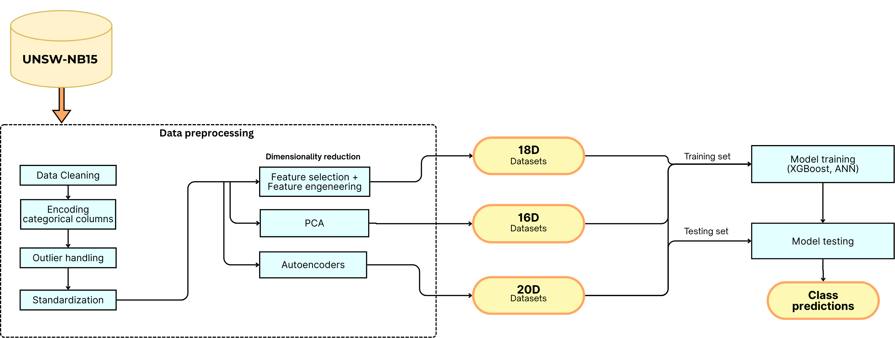

# Network Intrusion Detection using UNSW-NB15

This project performs multiclass classification of network traffic into normal traffic and nine different attack types using the UNSW-NB15 dataset. It also compares the effect of different dimensionality reduction techniques on several machine learning models.

## Methodology

- Data cleaning and basic EDA  
- Comparison of attack categories using boxplots across selected features  
- Feature engineering with additional ratio-based features

**Dimensionality reduction techniques:**
- Feature selection + feature engineering  
- PCA  
- Autoencoders

**Models compared:**
- MLP 
- XGBoost

## Dataset
- Training Set: 175,341 records with 45 features
- Testing Set: 82,332 records
- Attack Categories: 9 different attack types + Normal traffic
Features: Network traffic characteristics including protocol info, packet statistics, connection details, and timing information
You can find the dataset on Kaggle [here](https://www.kaggle.com/datasets/mrwellsdavid/unsw-nb15/data).

